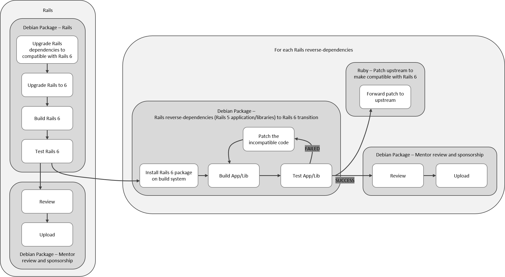

# A Rails 6 package transition in Debian

1. **Contact information**
    - Email: jmkim@pukyong.ac.kr
    - OpenPGP key fingerprint: 012E 4A06 79E1 4EFC DAAE 9472 D39D 8D29 BAF3 6DF8
        - Get OpenPGP public key: https://jongmin.dev/pgp
    - Timezone: UTC+9 (KST, Korea Standard Time)
    - Average awake hours:
        - Mon-Fri: 12:00 ~ 23:00
        - Sat-Sun: 12:00 ~ 02:00
    - IRC nickname: jmkim
    - IRC channel: #jmkim/oftc
    - Matrix nickname: @jmkim:matrix.org
    - Phone: +82 10-9978-7433
    - Postal: A12-1309, 45, Yongso-ro, Nam-gu, Busan, 48513, Republic of Korea
    - GitHub: https://github.com/jmkim
    - Salsa: https://salsa.debian.org/jmkim-guest
    - Debian Wiki: https://wiki.debian.org/JongminKim

1. What project do you want to work on? This can be a project that you came up with yourself, a project that you collaborated with a project maintainer or possible GSoC mentor with, or a project that you chose from [the ideas list](https://github.com/rubygsoc/rubygsoc/wiki/Ideas-List).
    - [Rails6 Package Transition in Debian](https://github.com/rubygsoc/rubygsoc/wiki/Rails6-Package-Transition-in-Debian)

1. Why do you like Ruby, and why do you want to work on a Ruby project in GSoC 2019?
    - Ruby, especially Rails (Ruby on Rails), is a popular language and frameworks for many people around my web projects. I saw a lot of startups developing web services using Rails or Sinatra. I did not deal with Ruby a lot, but I see a lot of people around me and feel the need for learning the Ruby.
    - My main Linux distribution, Debian, has a huge team, Ruby packaging team. I am one of the active contributors in Debian, and I would like to expand my scope of activity by doing Ruby packaging.
    - Rails 6 will be released in RailsConf on April 30th. After the release, Debian Developers will begin importing Rails 6 into Debian. This project should resolve many of the conflicts that have arisen since Rails was brought to Debian, and contribute directly to the Ruby projects on the Internet as well as Debian. I think this is a valuable opportunity to gain a large-scale Ruby projects contribution experience, not an intensive one Ruby project. At the same time, it will give me an in-depth experience of Ruby and Rails.

1. Describe your **experience** with the following: Ruby, C, other languages. (No experience is okay! We use this to evaluate projects and mentors for a good fit.)
    - Ruby
        - I created some script during writing this proposal, for measuring the reverse-dependencies of Rails:
            - A simple script for parsing Debian d/control file: https://github.com/jmkim/dpkg-control-parser
            - A simple script for download package from Debian Salsa and measure Rails reverse-dependencies: https://gist.github.com/jmkim/d5e3f1b9986d51fdbf9531d1b95909c5
    - C++
        - Universal Stock Crawler: https://github.com/jmkim/stock-crawler
        - I have experiences with C++ template programming, and tried to write some libraries which replaces C++ STL.
    - Shell scripts
        - Google Domains DDNS Updater: https://github.com/jmkim/google-domains-ddns-updater
        - PDF to JPG converter: https://github.com/jmkim/pdf2jpg-bash
        - Bootup mailer: https://github.com/jmkim/bootmail
    - Web projects
        - [PHP] Simplex - Simple PHP file explorer: https://github.com/jmkim/simplex
        - [JavaScript] Open source software archive mirror service: https://ftp.harukasan.org/
        - [JavaScript, PHP] PAKDD2017 international conference website: http://pakdd2017.snu.ac.kr/
        - [JavaScript, PHP] State public officials relationship graph in Busan, South Korea: http://fun.busan.com/2019busan_public.php
        - [Java] Search engine for getting the educational background statistics in Busan, South Korea: http://db.pknu.ac.kr/dc/prj/bsn201701/
        - [Java] Map for showing the educational background statistics in Busan, South Korea: http://db.pknu.ac.kr/dc/prj/bsn201702/
    - I'm currently learning Ruby and have confidence in learning Ruby, as a lot of languages I already learnt (C, C++, Java, PHP, JavaScript, Go, Shell, Python).
      I have plans to use Rails for my future projects, so I want to become an expert in Ruby through this project.

1. Describe your **educational background**, including school, degree plan, major, and (if any) past degrees, research area, publications, etc.
    - (2015-current) Bachelor's degree, IT Convergence and Application Engineering, Pukyong National University.

1. Have you sent pull requests to any Ruby open source projects? Code or documentation patches are both useful! Please provide links.
    - During Debian Ruby team activities, I did a little patch for Ruby package "sup" (sup-mail in Debian).
        - Overview: https://salsa.debian.org/ruby-team/sup-mail/commits/master
        - Package transitions:
            - https://salsa.debian.org/ruby-team/sup-mail/commit/fd0c7421e8019bafec5a57dc0d3decfa85b57150
            - https://salsa.debian.org/ruby-team/sup-mail/commit/33a28eb758712baa5582df203c908f2ec64c06ef
            - https://salsa.debian.org/ruby-team/sup-mail/commit/9eb0cad6fba3188f0858fc95c2a7dda574ff2cd1
        - Upstream PR:
            - [OPENED] https://github.com/sup-heliotrope/sup/pull/549

1. What **other commitments** do you have this summer aside from GSoC? What obstacles do you foresee this summer as far as contributing the full forty hours per week during the GSoC period? Are you planning any vacations or trips for fun this summer?
    - From 12 July to 27 July, I have a plan for participating DebCamp19 and DebConf19 (Debian conference). In this period, I'll do packaging sprint in Hacklab, in DebConf venue.
    - No other commitments for GSoC period. I'd definitely be able to give 40 hours per week, during the GSoC period.

1. How many classes are you taking this summer?
    - One class (Digital signal processing).
    - The semester will be ends on 24 June, but as only one class which can be take less than 3 hours everyday for studying, I won't compromise on the 40-hour schedule.

1. Do you have any other employment this summer?
    - No.

1. If you've participated in GSoC before, tell us about the project(s) you have done. Please include a way to reach your previous mentor(s).
    - Didn't participated any outreach programmes before.

1. **propose a project**

## Proposal: A Rails 6 package transition in Debian

### Project details
1. Update the Rails to 6.0.0 in Debian.
    1. Update the Rails dependencies in Debian [Appendix I](appendix-1.md).
1. Patch the Rails applications and libraries to make compatible with Rails 6.0.0 [Appendix II](appendix-2.md).
1. Upload Rails 6, its dependencies, Rails applications and libraries.

### Glossary
1. "Rails frameworks": Libraries and frameworks in Rails (actionpack, activesupport, railties, ...).
1. "Rails applications" or "Rails applications and libraries": Applications and libraries which dependent on Rails.

### Synopsis
Rails is one of the most popular web frameworks in the world.
Rails is distributed in several distributions, and Debian is one of them.

Almost of web applications made with Rails are distributed using RubyGems.
The package manager in Ruby, RubyGems, is designed to distribute the web libraries multiple versions at the same time.
This can make the Rails applications maintain with multiple version of Rails frameworks.
However, the package management system in Debian is designed to deliver one version at a time, which cause mangling the dependency relationship.

Currently, the Rails version in Debian is 5.2.2. And all of Ruby applications and libraries in Debian are dependent on Rails 5.2.2.
This proposal proposes to upgrade Rails to 6.0.0 and change all Debian packages that dependent on Rails to be compatible with Rails 6.0.0.

### Deliverables
- People will be able to use Rails 6 in Debian by typing "apt install rails".
- The upcoming Rails 6 will be released on April 30[1]. With this proposal roadmap, Debian users will be able to use Rails 6 within 4 months after release.
- By patching the Rails applications and libraries and forward to their upstream, make them do fast transition to compatible with Rails 6.

### Success criteria
1. Can install Rails 6 on Debian with "apt install rails".
1. After Rails 6 released in Debian, all the packages should not have FTBFS (Failed To Build From Source).

### Packaging bases

#### Workflow diagram

#### Measured values
1. In Debian, 169 packages dependent on Rails [Appendix II](appendix-2.md).
    1. 11 applications dependent on Rails:
        - camping, coquelicot, debci, diaspora, gitaly, gitlab, open-build-service, passenger, redmine, schleuder, sonic-pi
    1. 158 packages are the libraries which dependent on Rails frameworks.
1. In Debian, the count of reverse-dependencies of each Rails packages [Appendix II](appendix-2.md) are:
    - ruby-actioncable: none
    - ruby-actionmailbox: none (new module introduced from 6.0.0)
    - ruby-actionmailer: 8
    - ruby-actionpack: 25
    - ruby-actiontext: none (new module introduced from 6.0.0)
    - ruby-actionview: 5
    - ruby-activejob: none
    - ruby-activemodel: 17
    - ruby-activerecord: 37
    - ruby-activestorage: none
    - ruby-activesupport: 69
    - ruby-railties: 40
    - ruby-rails: 32
    - rails: 15
1. In Rails, the count of breaking changes, the version between 5 and 6 [Appendix III](appendix-3.md) are:
    - actioncable: 3
    - actionmailbox: none (new module introduced from 6.0.0)
    - actionmailer: 1
    - actionpack: 5
    - actiontext: none (new module introduced from 6.0.0)
    - actionview: 7
    - activejob: 2
    - activemodel: 3
    - activerecord: 21
    - activestorage: 3
    - activesupport: 12
    - railties: 21
1. As almost Rails interfaces as it is, it might be not at all packages need changes. If a patch is needed, make a transition with following [Appendix III](appendix-3.md).

### Timeline (based on measured values)
1. 7th May ~ 11th May: Update Rails dependencies to compatible with Rails 6.0.0.
1. 12th May ~ 18th May: Update Rails package to 6.0.0.
1. 19th May ~ 25th May: Update Rails package to 6.0.0 and release it with its dependencies into experimental. This might be done prior to the coding phase.
1. Week 1 (26th May ~ 1st June)
    - Learning the patching, with lesser changes Rails frameworks (actionmailer, activeview, actionpack, actionmodel).
    - ruby-actionmailer
        - ruby-mail-gpg
        - ruby-messagebus-api
        - ruby-exception-notification
    - ruby-activeview
        - ruby-rbpdf
        - ruby-rails-deprecated-sanitizer
    - ruby-actionpack
        - ruby-actionpack-page-caching
        - ruby-diaspora-federation-rails
        - ruby-escape-utils
        - ruby-gon
        - ruby-haml-magic-translations
        - ruby-ice-cube
        - ruby-redis-actionpack
        - ruby-rack-google-analytics
        - ruby-rails-timeago
    - ruby-activemodel
        - ruby-rails-observers
        - ruby-email-validator
        - ruby-openid-connect
        - ruby-rspec-collection-matchers
        - ruby-state-machines-activemodel
        - ruby-validate-url
        - ruby-activeldap
        - ruby-acts-as-api
        - ruby-pundit
        - ruby-sequel
1. Week 2 (2nd June ~ 8th June)
    - activesupport has a lot of breaking changes.
    - ruby-activesupport
        - ruby-awesome-print
        - ruby-babosa
        - ruby-backports
        - ruby-blade
        - ruby-case-transform
        - ruby-climate-control
        - ruby-clockwork
        - ruby-cocaine
        - ruby-delorean
        - ruby-excon
        - ruby-grape
        - ruby-grape-entity
        - ruby-grape-path-helpers
        - ruby-hashie
        - ruby-html-pipeline
1. Week 3 (9th June ~ 15th June)
    - activesupport has a lot of breaking changes.
    - ruby-activesupport
        - ruby-oj
        - ruby-omniauth-crowd
        - ruby-origin
        - ruby-rabl
        - ruby-rack-oauth2
        - ruby-rails-dom-testing
        - ruby-redis-activesupport
        - ruby-shoulda-matchers
        - ruby-spring-watcher-listen
        - ruby-swd
        - ruby-task-list
        - ruby-timecop
        - ruby-treetop
        - ruby-webfinger
        - ruby-wikicloth
1. Week 4 (16th June ~ 22nd June)
    - Both activesupport and activerecord have a lot of breaking changes.
    - activerecord is related to RDBMS connector, so transition might quite complex than others.
    - ruby-activerecord
        - ruby-activemodel-serializers-xml
        - ruby-activerecord-import
        - ruby-activerecord-nulldb-adapter
        - ruby-acts-as-list
        - ruby-acts-as-taggable-on
        - ruby-acts-as-tree
        - ruby-after-commit-queue
        - ruby-attr-encrypted
        - ruby-database-cleaner
        - ruby-default-value-for
        - ruby-delayed-job
        - ruby-delayed-job-active-record
        - ruby-em-synchrony
        - ruby-factory-bot
        - ruby-fast-gettext
1. Week 5 (23rd June ~ 29th June)
    - activerecord is related to RDBMS connector and has a lot of breaking changes, so transition might be complex than others.
    - ruby-activerecord
        - ruby-flipper
        - ruby-kaminari
        - ruby-model-tokenizer
        - ruby-moneta
        - ruby-parallel
        - ruby-paranoia
        - ruby-roxml
        - ruby-seamless-database-pool
        - ruby-seed-fu
        - ruby-sequenced
        - ruby-state-machines-activerecord
        - ruby-stringex
        - ruby-thinking-sphinx
        - ruby-validate-email
1. Week 6 (30th June ~ 6th July)
    - Railties handles the command line interfaces and has a lot of breaking changes, so transition might be complex than others.
    - ruby-railties
        - ruby-actionpack-xml-parser
        - ruby-backbone-on-rails
        - ruby-browser
        - ruby-coffee-rails
        - ruby-doorkeeper
        - ruby-entypo-rails
        - ruby-factory-bot-rails
        - ruby-font-awesome-rails
        - ruby-generator-spec
        - ruby-i18n-inflector-rails
        - ruby-jquery-rails
        - ruby-jquery-scrollto-rails
        - ruby-jquery-ui-rails
        - ruby-js-routes
1. Week 7 (7th July ~ 11th July)
    - Railties handles the command line interfaces and has a lot of breaking changes, so transition might be complex than others.
    - ruby-railties
        - ruby-devise
        - ruby-devise-two-factor
        - ruby-jira
        - ruby-lograge
        - ruby-markerb
        - ruby-momentjs-rails
        - ruby-peek
        - ruby-rabl-rails
        - ruby-rails-i18n
        - ruby-request-store
        - ruby-sass-rails
        - ruby-sidekiq
        - ruby-versionist
        - ruby-web-console
        - ruby-webpack-rails
1. Week 8 (14th July ~ 20th July, in DebCamp19)
    - Package binary packages in DebCamp Hacklab. Rails applications are huge and complex, so work in DebCamp might be helpful for asking a guide from Ruby developers and Debian mentors.
    - Binary packages (Rails applications)
        - camping
        - coquelicot
        - debci
        - diaspora
        - gitlab
1. Week 9 (21st July ~ 26 July, in DebConf19)
    - Package binary packages in DebCamp Hacklab. Rails applications are huge and complex, so work in DebCamp might be helpful for asking a guide from Ruby developers and Debian mentors.
    - Binary packages (Rails applications)
        - gitaly
        - open-build-service
        - passenger
        - redmine
        - schleuder
        - sonic-pi
1. Week 10 (28th July ~ 3rd August)
    - Package complex libraries. ruby-rails contains all of Rails frameworks.
    - Weak ruby-rails (might not contain all the Rails frameworks)
        - ruby-actionpack-action-caching
        - ruby-asset-sync
        - ruby-codemirror-rails
        - ruby-data-migrate
        - ruby-devise-lastseenable
        - ruby-enumerize
        - ruby-hamlit
        - ruby-joiner
        - ruby-leaflet-rails
        - ruby-premailer-rails
        - ruby-rails-tokeninput
        - ruby-sprockets-rails
        - ruby-validates-hostname
        - ruby-active-model-serializers
1. Week 11 (4th August ~ 10th August)
    - Package complex libraries. ruby-rails and rails contains all the Rails frameworks.
    - Strong ruby-rails (contain all the Rails frameworks)
        - ruby-appraiser
        - ruby-flot-rails
        - ruby-gettext-i18n-rails
        - ruby-gettext-i18n-rails-js
        - ruby-rqrcode-rails3
        - ruby-sentry-raven
        - ruby-simple-captcha2
        - ruby-snorlax
        - ruby-yaml-db
        - ruby-api-pagination
        - ruby-carrierwave
        - ruby-combustion
    - rails
        - ruby-dalli
        - ruby-globalid
1. Week 12 (11th August ~ 17th August)
    - Package complex libraries. ruby-rails and rails contains all the Rails frameworks.
    - rails
        - ruby-haml
        - ruby-haml-rails
        - ruby-hashie-forbidden-attributes
        - ruby-health-check
        - ruby-jbuilder
        - ruby-jquery-atwho-rails
        - ruby-js-image-paths
        - ruby-mobile-fu
        - ruby-rails-html-sanitizer
        - ruby-responders
        - ruby-roadie-rails
        - ruby-rspec-rails
        - ruby-spring
        - ruby-voight-kampff
1. Week 13 (18th August ~ 24th August)
    - Ready for submit final work report

### Some notes regarding timeline
1. Week 8~9: Have a plan for participating DebCamp19 and DebConf19 (Debian conference) from 12 July to 27 July. In this period, do sprint in Hacklab, in DebConf venue.
1. A lot of packages should be done transition, so the timeline should be re-estimate occasionally during community bonding phase and coding phase.

### References
- [1] https://weblog.rubyonrails.org/2018/12/20/timeline-for-the-release-of-Rails-6-0/
- [2] https://github.com/rails/rails

## Appendices
1. [Appendix I: Measured Rails dependencies in Debian](appendix-1.md)
1. [Appendix II: Measured Rails reverse-dependencies in Debian](apendix-2.md)
1. [Appendix III: Breaking changes on Rails 6](appendix-3.md)

